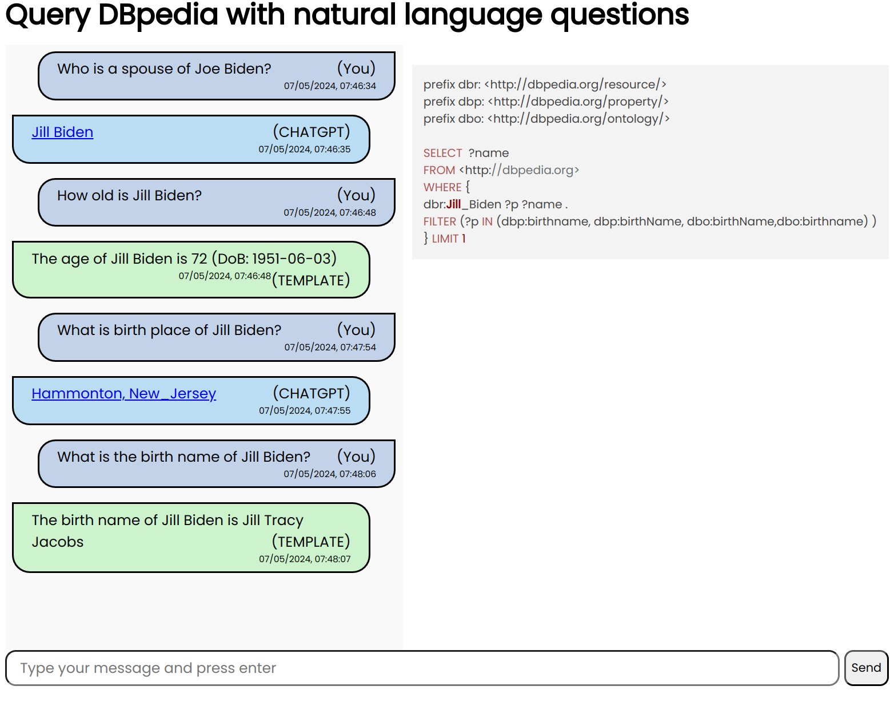

# Welcome to DBRuped!

## What it is

**DBRuped** is an online service that facilitates communication with **DBpedia** using natural languages. You can type your questions in English (or other languages) and retrieve the required data from DBpedia. However, please note that the accuracy of the answers is not guaranteed. It depends on the availability of the required information in DBpedia and the system's ability to convert your question into the appropriate SPARQL query, which largely depends on the question itself.

## Why DBRuped was created

**DBRuped** is an endeavour aimed at creatively expanding a challenge task for a candidate at SciBite company. This project is not associated with any business ideas.

## How DBRuped works

**DBRuped** converts incoming natural language (NL) questions into SPARQL queries and submits them to DBpedia. With some chance, it can return a reasonable answer. **DBRuped** converts NL queries in two ways. Firstly, it utilizes a set of predefined templates. It attempts to find a template that matches an NL sentence and then builds a SPARQL query according to the selected template. In addition to a query, a template defines one or more patterns for output formatting. If no template is found for the sentence, **DBRuped** switches to the second method. It connects to ChatGPT and sends a prompt requesting the conversion of the NL sentence to a DBpedia SPARQL query. With some chance (which is generally not bad), ChatGPT provides a reasonable query that is then executed by DBpedia.

## How template definition looks like 

Templates are currently defined in the file */src/main/resources/templates/QuestionTemplates.txt* within the source tree. One file can contain multiple templates. Here is an example:

```## Age related questions ##
#QUESTION: How old is ${PERSON}?
#QUESTION: What is the age of ${PERSON}?
#QUESTION: What is ${PERSON}'s age?
#QUERY:
prefix dbr: <http://dbpedia.org/resource/>
prefix dbp: <http://dbpedia.org/property/>
prefix dbo: <http://dbpedia.org/ontology/>

SELECT ?dob
FROM <http://dbpedia.org>
WHERE {
dbr:${PERSON:space2underscore} dbo:birthDate ?dob .
} LIMIT 1
#RETURN: ${dob:date2age}
#RETURN[LONG]: The age of ${PERSON} is ${dob:date2age} (DoB: ${dob})
```

## Template definition structure

The template definition consists of three sections: QUESTION, QUERY, and RETURN. The QUESTION section may have multiple entries, and any entry can match to allow the template to be selected. A question can have variable capturing placeholders that match any substring and capture such substrings into corresponding variables. These variables can then be used in QUERY and RETURN sections.

The QUERY section contains a SPARQL query that serves the above questions. This section can also have placeholders but not for capturing; rather, for substitution. It can be direct variable substitution like `${PERSON}`, and also substitution with pre-processing `${PERSON:space2underscore}`, where `space2underscore` is one (or more) of the predefined functions.

When the query is executed, all names from the SELECT statement will form new variables that will have values returned by the query. These variables will be combined with variables from the QUESTION section. Only one entry in the QUERY section is possible.

The RETURN section contains text that can have substitution placeholders like in the QUERY section. The RETURN section may have multiple entries, but each entry must have a unique tag in square brackets. Absence of brackets means an empty tag, so RETURN and RETURN[] are equivalent definitions. One or another form of output can be selected by tags. By default, the Web UI tries to find an output with the LONG tag, and if not found, takes the first entry regardless of its tag. Pre-processing functions are also allowed in the RETURN section.

## Pre-processing functions

Pre-processing functions convert a variable's value before substitution. Multiple functions can be applied, such as ${VAR:FUNC1:FUNC2}. Currently, the following functions are defined (refer to /src/main/java/me/gostev/scibite/dbruped/text/SimpleSubstitutorAndEvaluator.java):
 - **space2underscore**
 - **date2year**
 - **date2age**
Additional functions can be easily defined.

# Installation

To build **DBRuped** run:
```
mvn package
```
To build a Docker image run:
```
docker build -t dbruped .
```
To run: make sure that you defined an env variable **CHATGPT_API_KEY** with API key. To run with Docker run:
```
docker run -p 8080:8080 -eCHATGPT_API_KEY=abcdefg  dbruped
```
## Live instance
The live instance is available at [http://scibite.gostev.me/index.html](http://scibite.gostev.me/index.html)

